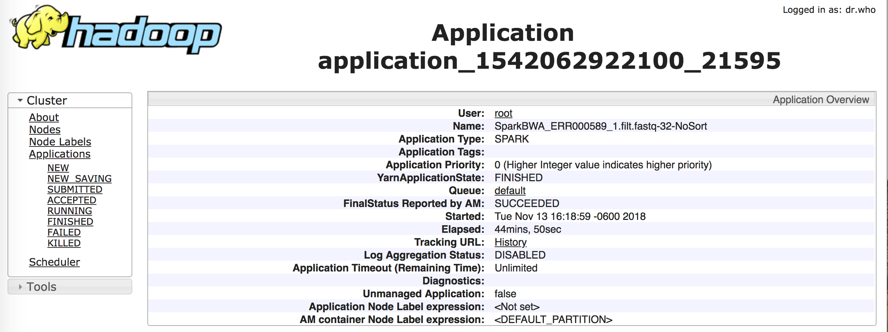

# Validation [Running alignment]

<a href=https://github.com/kckenneth/GenomicAssembly/blob/master/setup_spark.md><< 1. Spark setup</a>  
<a href=https://github.com/kckenneth/GenomicAssembly/blob/master/setup_hadoop.md><< 2. Hadoop setup</a>  
<a href=https://github.com/kckenneth/GenomicAssembly/blob/master/setup_HG38.md><< 3. Human Genome in HDFS</a>  
**== Alignment** 
	
### Setting the Yarn in Spark environment
Before we validate our alignment, we need to first understand the spark and yarn. Basically, Spark is a built-in RDD we installed. On top of the spark local file system, we installed Hadoop distributed file system (HDFS). Now we're going to submit our job from spark using `spark-submit` using `YARN` (Yet Another Resource Navigator or Negotiator). Yarn is a resource manager for HDFS, not for spark. So we're crossing the two systems here. Spark must know where is the resource manager `Yarn` for HDFS, which is basically a configuration file. So we need to set the hadoop configuration path in spark environment. 

```
# cd /usr/local/spark/conf
# vi spark-env.sh.template
```
Copy and paste the following anywhere. There are many commented description.
```
export HADOOP_CONF_DIR="/usr/local/hadoop/etc/hadoop/"
```
Rename the spark environment file
```
# mv spark-env.sh.template spark-env.sh
```

**Note**  

If you don't set up the spark environment, it will throw an error when you submit `spark-submit` job. I've also seen others use `spark-defaults.conf` and change the `spark.master` to `yarn` replacing the `spark://master:7077`. More <a href=https://www.linode.com/docs/databases/hadoop/install-configure-run-spark-on-top-of-hadoop-yarn-cluster/>details</a>.

When you run spark job on yarn, there are two modes you can use: cluster and client modes. Understanding the difference between the two modes is important for choosing an appropriate memory allocation configuration, and to submit jobs as expected. A Spark job consists of two parts: _Spark Executors_ that run the actual tasks, and a _Spark Driver_ that schedules the Executors.

- Cluster mode: everything runs inside the cluster. You can start a job from your laptop and the job will continue running even if you close your computer. In this mode, the Spark Driver is encapsulated inside the YARN Application Master. 

- Client mode the Spark driver runs on a client, such as your laptop. If the client is shut down, the job fails. Spark Executors still run on the cluster, and to schedule everything, a small YARN Application Master is created.

Client mode is well suited for interactive jobs, but applications will fail if the client stops. For long running jobs, cluster mode is more appropriate.

For interactive mode, you go and use `spark-shell` by commands `$SPARK_HOME/bin/spark-shell`. Go <a href=https://github.com/kckenneth/Spark/blob/master/setup_spark.md>how to use spark-shell</a>. 

### Making less verbose in spark-submit [Optional]

If you want to make less verbose in `spark-submit`, <a href=https://github.com/kckenneth/Cassandra/blob/master/streaming_tweet.md>Here</a> is how to do it. 

### Validate the alignment (1 - 2 hours)

Make sure that BWA Spark is correctly installed and that the command below runs to the end. If you are successful, you will see a file called FullOutput.sam (4.67 GB) created in the /user/hadoop/OUTPUT_DIR directory of your HDFS. Set the num-executors to the number of nodes in your cluster. Set executor-cores to the number of cores in each VM in your cluster -- and if you see out of memory errors, go down. The --index parameter should contain the base name of your reference genome files. Make sure the path to the SparkBWA jar file is correct in the line below.

```
# $SPARK_HOME/bin/spark-submit --class com.github.sparkbwa.SparkBWA --master yarn --driver-memory 1500m --executor-memory 15g --executor-cores 4 --verbose --num-executors 10 /root/SparkBWA/target/SparkBWA-0.2.jar -m -r -p --index /Data/HumanBase/Homo_sapiens_assembly38.fasta.gz -n 32 -w "-R @RG\tID:foo\tLB:bar\tPL:illumina\tPU:illumina\tSM:ERR000589" /ERR000589_1.filt.fastq /ERR000589_2.filt.fastq /Data/HumanBase/
```

There would be a bunch of logs showing up. One of the log I copied and pasted here. 

```
	 client token: N/A
	 diagnostics: AM container is launched, waiting for AM container to Register with RM
	 ApplicationMaster host: N/A
	 ApplicationMaster RPC port: -1
	 queue: default
	 start time: 1542144791497
	 final status: UNDEFINED
	 tracking URL: http://spark1:8088/proxy/application_1542062922100_21595/
	 user: root
```
You can go to the following link in your browser to check the status of your job. 

```
http://50.23.42.89:8088/proxy/application_1542062922100_21595/
```

<p align="center">
</p>
<p align="center">Figure 1. YARN</p>

Once it's done, the message will end with
```
18/11/13 15:44:15 INFO spark.SparkContext: Successfully stopped SparkContext
18/11/13 15:44:15 INFO util.ShutdownHookManager: Shutdown hook called
18/11/13 15:44:15 INFO util.ShutdownHookManager: Deleting directory /tmp/spark-e1e5a3d3-b39e-4f4f-8070-64175cb2916a
```

### Check the output file in HDFS

You can do one of the following commands, they will give you the list of the HDFS directory. Basically, in any directory in HDFS you want to browse, it do the same thing in your local filesystem. Just prefix with `hadoop fs` or `hdfs dfs` and all the regular bash commands prefixed with `-`. For eg, listing becomes `-ls`. 
```
# hadoop fs -ls /
# hdfs dfs -ls /

drwxr-xr-x   - root supergroup          0 2018-11-13 15:34 /Data
-rw-r--r--   3 root supergroup 1804779901 2018-11-12 14:28 /ERR000589_1.filt.fastq
-rw-r--r--   3 root supergroup 1804779901 2018-11-12 14:40 /ERR000589_2.filt.fastq
drwxr-xr-x   - root supergroup          0 2018-11-13 15:32 /user
```
**Note**  
You can also create a directory in HDFS. 
```
# hdfs dfs -mkdir /Books
```

### To move the output from HDFS to local filesystem
```
# hdfs dfs -copyToLocal Output_ERR000589/* ./
```
