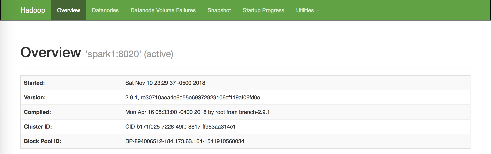

# HDFS Setup (All nodes)

## 1. Download and install hadoop `2.9.1` version.
```
# curl http://apache.claz.org/hadoop/core/hadoop-2.9.1/hadoop-2.9.1.tar.gz| tar -zx -C /usr/local --show-transformed --transform='s,/*[^/]*,hadoop,'
```
## 2. Get the JAVA environment setup. Note, this is javac, not java. 
```
# echo "export JAVA_HOME=\"$(readlink -f $(which javac) | grep -oP '.*(?=/bin)')\"" >> ~/.bash_profile
```
## 3. Define the hadoop path
```
# vi ~/.bash_profile

export HADOOP_HOME=/usr/local/hadoop
export HADOOP_MAPRED_HOME=$HADOOP_HOME
export HADOOP_HDFS_HOME=$HADOOP_HOME
export YARN_HOME=$HADOOP_HOME
export PATH=$PATH:$HADOOP_HOME/bin:$HADOOP_HOME/sbin
```

Activate the bash_profile
```
# source ~/.bash_profile
```

## 4. Check disks (Optional)
Since we only launched one disk (100GB), we will only see one disk. So it does not matter if we skip this step. But to check the disk to be on the safe side. 
```
# fdisk -l | grep Disk | grep GB
Disk /dev/xvda: 107.4 GB, 107374182400 bytes, 209715200 sectors

# mount | grep ' \/ '
/dev/xvda2 on / type ext3 (rw,noatime,seclabel,data=ordered)
```

## Create the data directory
we don't have a separate disk to hold the data, so just use /root:
```
# mkdir -m 777 /data
```
-------------
# Hadoop Configuration Setup 
# (on master node, spark1, first --> scp to other nodes)

```
# cd $HADOOP_HOME/etc/hadoop      (Similar to /usr/local/hadoop/etc/hadoop)
# echo "export JAVA_HOME=\"$JAVA_HOME\"" > ./hadoop-env.sh
```
There are 4 xml files we will be updating.  
- core-site.xml 
- yarn-site.xml 
- mapred-site.xml.template 
- hdfs-site.xml 

After all those configurations setup, we will copy them into other 2 hdfs nodes. 

### 1. core-site.xml
```
# vi core-site.xml

  <?xml version="1.0"?>
  <configuration>
    <property>
      <name>fs.defaultFS</name>
      <value>hdfs://spark1/</value>
    </property>
  </configuration>
```

### 2. yarn-site.xml
```
# vi yarn-site.xml

<?xml version="1.0"?>
  <configuration>
    <property>
      <name>yarn.resourcemanager.hostname</name>
      <value>spark1</value>
    </property>
    <property>
      <name>yarn.nodemanager.aux-services</name>
      <value>mapreduce_shuffle</value>
    </property>
    <property>
       <name>yarn.resourcemanager.bind-host</name>
       <value>10.77.147.231</value>
      </property>
     <property>
        <name>yarn.nodemanager.resource.cpu-vcores</name>
        <value>4</value>
    </property>
    <property>
        <name>yarn.nodemanager.resource.memory-mb</name>
        <value>4096</value>
    </property>
    <property>
      <name>yarn.scheduler.maximum-allocation-mb</name>
      <value>20000</value>
    </property>
    <property>
      <name>yarn.nodemanager.resource.memory-mb</name>
      <value>32768</value>
    </property>
    <property> 
      <name>yarn.scheduler.minimum-allocation-mb</name> 
      <value>3000</value> 
    </property>
  </configuration>
```

### 3. mapred-site.xml.template

```
# vi mapred-site.xml.template

  <?xml version="1.0"?>
  <configuration>
    <property>
      <name>mapreduce.framework.name</name>
      <value>yarn</value>
    </property>
  </configuration>
```
Change the name to `mapred-site.xml`
```
# mv mapred-site.xml.template mapred-site.xml
```

### 4. hdfs-site.xml
```
vi hdfs-site.xml

  <?xml version="1.0"?>
  <configuration>
    <property>
        <name>dfs.datanode.data.dir</name>
        <value>file:///data/datanode</value>
    </property>

    <property>
        <name>dfs.namenode.name.dir</name>
        <value>file:///data/namenode</value>
    </property>

    <property>
        <name>dfs.namenode.checkpoint.dir</name>
        <value>file:///data/namesecondary</value>
    </property>
  </configuration>
```

#### Distribute all configuration files to other nodes
```
# rsync -a /usr/local/hadoop/etc/hadoop/* spark2:/usr/local/hadoop/etc/hadoop/
# rsync -a /usr/local/hadoop/etc/hadoop/* spark3:/usr/local/hadoop/etc/hadoop/
# rsync -a /usr/local/hadoop/etc/hadoop/* spark4:/usr/local/hadoop/etc/hadoop/
# rsync -a /usr/local/hadoop/etc/hadoop/* spark5:/usr/local/hadoop/etc/hadoop/
```
Change the nodes information in `slaves` file. Remove anything in there. 
```
# vi slaves

spark1
spark2
spark3
spark4
spark5
```

# Create HDFS FileSystem (on master node)

First we will format the namenode before we spin up our cluster. If you format a running cluster, you will lose everthing. 
```
# hdfs namenode -format
# start-dfs.sh
# start-yarn.sh
```
Note  
To stop the HDFS node or yarn
```
# stop-dfs.sh
# stop-yarn.sh
```

Check the HDFS status
```
# hdfs dfsadmin -report

Configured Capacity: 526449623040 (490.29 GB)
Present Capacity: 486023487488 (452.64 GB)
DFS Remaining: 486023364608 (452.64 GB)
DFS Used: 122880 (120 KB)
DFS Used%: 0.00%
Under replicated blocks: 0
Blocks with corrupt replicas: 0
Missing blocks: 0
Missing blocks (with replication factor 1): 0
Pending deletion blocks: 0

-------------------------------------------------
Live datanodes (5):

Name: 184.173.63.162:50010 (spark3.mids.com)
Hostname: spark3.mids.com
Decommission Status : Normal
Configured Capacity: 105289924608 (98.06 GB)
DFS Used: 24576 (24 KB)
Non DFS Used: 2729730048 (2.54 GB)
DFS Remaining: 97204936704 (90.53 GB)
DFS Used%: 0.00%
DFS Remaining%: 92.32%
Configured Cache Capacity: 0 (0 B)
Cache Used: 0 (0 B)
Cache Remaining: 0 (0 B)
Cache Used%: 100.00%
Cache Remaining%: 0.00%
Xceivers: 1
Last contact: Sat Nov 10 22:30:15 CST 2018
Last Block Report: Sat Nov 10 22:29:42 CST 2018

...
...
...
...
```
Check the YARN status
```
# yarn node -list

18/10/12 05:53:31 WARN util.NativeCodeLoader: Unable to load native-hadoop library for your platform... using builtin-java classes where applicable
18/10/12 05:53:32 INFO client.RMProxy: Connecting to ResourceManager at master/50.23.91.123:8032
Total Nodes:3
         Node-Id	     Node-State	Node-Http-Address	Number-of-Running-Containers
ec2-35-169-58-188.compute-1.amazonaws.com:40476	        RUNNING	ec2-35-169-58-188.compute-1.amazonaws.com:8042	                           0
ec2-35-169-58-188.compute-1.amazonaws.com:42658	        RUNNING	ec2-35-169-58-188.compute-1.amazonaws.com:8042	                           0
ec2-54-208-77-124.compute-1.amazonaws.com:44917	        RUNNING	ec2-54-208-77-124.compute-1.amazonaws.com:8042	                           0
```
# Checking the cluster
Go to your browser
To check your cluster, browse to:  
master IP = `184.173.63.164`. Don't change the port. 
```
http://184.173.63.164:50070/dfshealth.html
http://184.173.63.164:8088/cluster
http://184.173.63.164:19888/jobhistory (for Job History Server) [might not work unless you have job running]
```
#### dfshealth.html

<p align="center">
</p>
<p align="center">Figure 1. DFS Health</p>

#### cluster

<p align="center">
</p>
<p align="center">Figure 2. Cluster Control</p>

### Checking the java

Log files are located under `$HADOOP_HOME/logs`. You can check the java services running once your cluster is running using `jps`.
```
# jps

28627 ResourceManager
28134 NameNode
28733 NodeManager
29230 Jps
28431 SecondaryNameNode
```


# System Setup
Install 
```
# yum install -y rsync net-tools java-1.8.0-openjdk-devel ftp://fr2.rpmfind.net/linux/Mandriva/devel/cooker/x86_64/media/contrib/release/nmon-14g-1-mdv2012.0.x86_64.rpm
```


To allow permission on each directory. So far we have worked on `/data` and `/usr/local` directory. 
```
# chown -R hadoop.hadoop /data
# chown -R hadoop.hadoop /usr/local/hadoop
```
